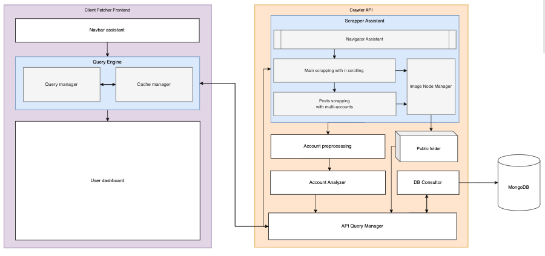

# Instagram-Dashboard
Instagram Crawler App is a powerful tool designed to extract relevant information from an Instagram profile, including basic information and all posts. The app uses efficient and innovative methods, such as task distribution among multiple extractors, to ensure high speed and efficiency. The app also utilizes multiple accounts to avoid detection of abusive activity.

With Instagram Crawler App, users can extract information from any public Instagram profile, including user information, posts, and engagement metrics. Whether you're a social media manager, influencer, or researcher, Instagram Crawler App provides a powerful set of tools to analyze and extract insights from Instagram data.



Instagram Crawler App is designed for scalability and can easily handle large volumes of data from diverse sources. The app incorporates advanced data processing techniques to ensure accurate and actionable insights, such as sentiment analysis, topic modeling, and clustering.

With Instagram Crawler App, you can extract and analyze Instagram data with ease, gain insights into user behavior, identify emerging trends, and make data-driven decisions. Whether you're monitoring your own profile, tracking a competitor, or analyzing social media trends, Instagram Crawler App provides a powerful tool to help you stay ahead of the curve.

## Runing crawler_api(Flask server)
If you want to run the server, you need to install the requirements first. You can do this by running the following command:
```bash
    pip3 install -r requirements.txt
```

Then you can run the server by running the following command:
```bash
    flask --app crawler_api.flaskr run
```

## Runing clink(React app)
If you want to run the app, you need to install the requirements first. You can do this by running the following command:

Firstly go to the clink folder and run the following command:
```bash
    npm install
```

Then you can run the app by running the following command in the same folder:
```bash
    npm start
```
